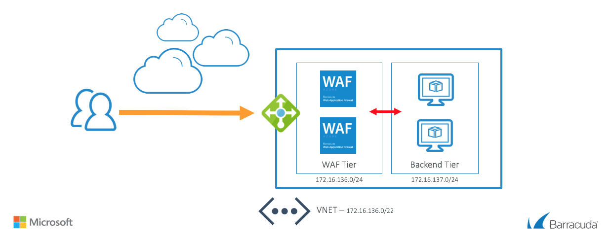

# Barracuda Web Application Firewall Quick Start

## Introduction
This HashiCorp Terraform template deploy the Barracuda Web Application Firewall in a new VNET. Deployment is done with in a one-armed fashion installing a cluster of 2 units into a subnet. The backend server can be installed in the provisioned backend subnet or can be any type of website where access over layer 3 can be provided to, including Azure Websites (Paas), Azure App Service Environment, Azure Service Fabric but also website running on-premise or other VNET's.

To adapt this deployment to your requirements you can modify the variables.tf file and/or the deployment script.



## Prerequisites
The solution does a check of the template when you use the provide scripts. It does require that [Programmatic Deployment](https://azure.microsoft.com/en-us/blog/working-with-marketplace-images-on-azure-resource-manager/) is enabled for the Barracuda Web Application Firewall BYOL or PAYG images. Barracuda recommends use of **D**, **D_v2**, **F** or newer series. 

## Deployed resources
Following resources will be created by the template:
- One Azure VNET with 2 subnets (for the WAF and backend servers, additional subnets can be configured afterwards in the terraform template)
- External Azure Load Balancer with a static public IP and rules for 80, 443 and management of both WAF units
- Two Virtual machine with a network interface and public IP

**Note** The backend resources are *not* automatically created by the template. This has to be done manually after template deployment has finished or by adapting the Terraform template.

## Template Parameters
| Parameter Name | Description
|---|---
password | Password for the Barracuda WAF admin web ui
location | Location for the deployment
prefix | identifying prefix for all VM's being build. e.g WeProd would become WeProd-VM-NGF (Max 19 char, no spaces, [A-Za-z0-9]
imageSKU | SKU Hourly (PAYG) or BYOL (Bring your own license)
vmSize | Size of the VMs to be created
vnet | Network range of the VNET (e.g. 172.16.136.0/22)
subnet_ngf | Network range of the Subnet containing the NextGen Firewall (e.g. 172.16.136.0/24)
subnet_backend | Network range of the backend subnet (e.g. 172.16.137.0/24)

## Launching the Template

Terraform requires Azure Credentials to deploy to the correct subscription. Terraform recommends  (such as within a CI server/automation) - and [authenticating via the Azure CLI](https://www.terraform.io/docs/providers/azurerm/authenticating_via_azure_cli.html) when you're running Terraform locally using the Azure Cloud Shell.

Credentials to be installed in the NGF or to access Azure can be stored in a secrets.tfvars file with the following format:

```
password        = ""
subscription_id = ""
client_id       = ""
client_secret   = ""
tenant_id       = ""
```

Alternatively these credentials can be provided using when launching terraform as [an argument](https://www.terraform.io/intro/getting-started/variables.html) or [via environment variables](https://www.terraform.io/intro/getting-started/variables.html).

The package provides a deploy.sh and deploy-docker.sh script. The deploy.sh can be used when Terraform is installed localy. The deploy-docker.sh will deploy using Terraform available in a docker image. Terraform is also available in the Azure Cloud Shell. 

To delete the whole deployment you can use the destroy.sh or destroy-docker.sh script.

After the deployment you can configure the Barracuda Web Application Firewall following [the guide](https://campus.barracuda.com/product/webapplicationfirewall/doc/13861632/barracuda-web-application-firewall-quick-start-guide-microsoft-azure/?sl=AWAwTVaCWVWOJEbev-I2&so=1) on [the Barracuda Campus website](https://campus.barracuda.com). The first WAF in the cluster is accessible via the port 8000 the second WAF via port 8001 on the public IP of the Azure Load Balancer. It is a good security practive to limit access to the web ui to specific management IP's or only access the management UI via the private IP's of the units.